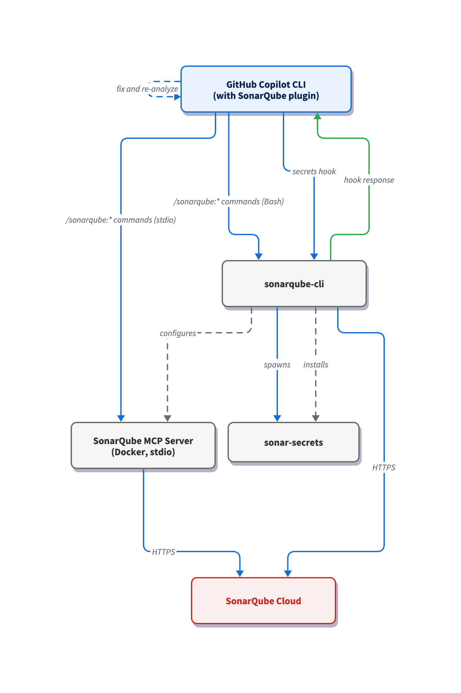

# Set up the SonarQube Plugin for GitHub Copilot CLI

## TL;DR overview

* The SonarQube plugin for GitHub Copilot CLI brings quality gate, dependency risk, coverage, and issue checks into Copilot CLI through dedicated slash commands.
* SonarQube plugin skills assists terminal-driven Copilot workflows where there’s no editor UI in the loop.
* SonarQube Agentic Analysis findings and fixes compress the development cycle from CLI prompting and PR-time review to analysis, remediation, and verification in one terminal session.
* Setup installs the SonarQube plugin and CLI, then wires the SonarQube MCP Server into Copilot CLI so the agent can reach the SonarQube analysis engine.

This blueprint configures the [SonarQube plugin](https://github.com/SonarSource/sonarqube-agent-plugins) for [GitHub Copilot CLI](https://github.com/features/copilot/cli) so that quality gates, issue scanning, coverage data, dependency risks, secrets detection, and [Agentic Analysis](https://www.sonarsource.com/products/sonarqube/agentic-analysis/) are reachable from within the same terminal session that wrote the code. The setup involves four components: the SonarQube plugin, [SonarQube CLI](https://cli.sonarqube.com/), [SonarQube MCP Server](https://www.sonarsource.com/products/sonarqube/mcp-server/), and both a hook and instructions for secrets-scanning and Agentic Analysis. Our step-by-step workflow references the Python-based [AWS CLI](https://github.com/aws/aws-cli) but can be applied to any project written in any [SonarQube-supported language](https://www.sonarsource.com/knowledge/languages/).

## When to use the SonarQube Plugin for GitHub Copilot CLI

- You drive Copilot from the terminal rather than an IDE, so there's no agent-mode UI reviewing each suggestion before it lands on disk.
- You want SonarQube findings accessible from inside the GitHub Copilot CLI session that wrote the code, not waiting on the next CI run.

## What you'll achieve

- SonarQube plugin installed and operational, exposing `/sonarqube:` slash commands from inside your GitHub Copilot CLI session.
- SonarQube CLI installed and authenticated as the local runtime layer for plugin setup.
- SonarQube MCP Server connecting GitHub Copilot CLI with your project on [SonarQube Cloud](https://www.sonarsource.com/products/sonarqube/cloud/).
- Secrets scanning configured to prevent GitHub Copilot CLI from reading files and prompts with sensitive values.
- (Optional) Agentic Analysis enabled to scan every file write, fix surfaced issues, and verify the fixes.

## Architecture



The SonarQube plugin registers `/sonarqube:` skills inside GitHub Copilot CLI but has no infrastructure of its own; the SonarQube CLI provides this. It owns the authenticated session stored in your system keychain after `sonar auth login`, handles the `mcp/sonarqube` container that Copilot CLI talks to over stdio, installs the secrets-scanning hook, and writes the `sonarqube.instructions.md` file that primes the agent to scan prompts for credentials and run Agentic Analysis on every file it modifies. Six skills route through the MCP server; three shell out to the SonarQube CLI directly via the Bash tool. Agentic Analysis rides that same Bash path: after the agent writes a file, it invokes `sonar analyze agentic`, applies the reported fixes, and re-runs the command until the file comes back clean.

## Prerequisites

- **GitHub Copilot subscription**
- **GitHub Copilot CLI** installed and authenticated
- [**SonarQube Cloud**](https://www.sonarsource.com/products/sonarqube/cloud/) **account** or [**SonarQube Server**](https://www.sonarsource.com/products/sonarqube/server/) with the demo project on board
- **SonarQube CLI** installed. The `sonar integrate copilot` command shipped in v0.11.0.1439; anything older won’t have it
- **Docker, Podman, or Nerdctl** up and running; the MCP server runs as a container
- **(Optional, but preferred):** a `sonar-project.properties` file pointing to your project on SonarQube Cloud
- **(Optional) Agentic Analysis** enabled at your SonarQube Cloud organization level (**Administration** > **Agent-Centric Development**)

**Demo project:** To follow along with this guide, fork [`aws/aws-cli`](https://github.com/aws/aws-cli) to your GitHub account, import it into SonarQube Cloud with CI-based analysis enabled, and clone it locally.

### Step 1 — Install the SonarQube plugin in GitHub Copilot CLI

Launch a Copilot CLI session from your project root, then add the SonarSource marketplace and install the plugin:

```
/plugin marketplace add SonarSource/sonarqube-agent-plugins
/plugin install sonarqube@sonar
```

Alternatively, you can execute the same flow from the terminal (without an active Copilot CLI session):

```shell
copilot plugin marketplace add SonarSource/sonarqube-agent-plugins
copilot plugin install sonarqube@sonar
```

Confirm the plugin is registered:

```shell
/plugin list
```

Then inspect the installed skills:

```shell
/skills
```

The plugin contributes the `/sonarqube:` skills you'll use in the next steps, but does not bring up the MCP server or install the hook. That's the SonarQube CLI's job, covered next.

### Step 2 — Configure the integration

Next, invoke the `/sonarqube:sonar-integrate` skill and follow along with the integration sequence.

The skill first checks if SonarQube CLI has been installed. If not, you’ll be prompted to enable Copilot CLI to run the command to do so. If `sonar` is already on your `PATH`, SonarQube CLI is upgraded to the latest version.

You'll then be prompted to select the SonarQube connection type (EU by default), enter your SonarQube Cloud organization key, and authenticate to SonarQube:

```shell
sonar auth login -o <your-organization-key-here>
```

The ensuing `sonar auth login` flow opens your browser, runs OAuth, and stores the resulting token in your system keychain. Every downstream command (including the MCP server) reuses that session.

Once the browser is opened, click **Allow connection** and confirm that the authentication was successful.

Configure the SonarQube integration in your current project.

The Github Copilot CLI agent then runs the `sonar integrate copilot` command which accomplishes three things in one shot:

1. Writes a `sonarqube` MCP server entry into `.mcp.json` in the project root, so all Copilot CLI sessions (in the project) will have the MCP configured.
2. Installs a secrets-scanning hook (`hooks.json`) in Copilot CLI. When the Copilot CLI agent is about to read from or write to a file, the hook scans the file and prompt for credentials, and can deny the tool call if it finds any.
3. Generates a `sonarqube.instructions.md` file that primes the Copilot agent to refuse user prompts containing sensitive information and runs Agentic Analysis after every file write.

Inspect the produced MCP config:

```shell
cat .mcp.json
```

The `hooks.json` and `sonarqube.instructions.md` get written to paths the integrate command picks for you.

### Step 3 — Invoke the /sonarqube: slash commands

Open a fresh Copilot CLI session from the project directory so the MCP config loads cleanly:

```shell
cd ~/aws-cli
copilot
```

Confirm the MCP server is registered and ready.

```
/mcp show
```

Click `sonarqube` to view the MCP tools.

Now test a few skills to confirm the integration is working:

```
/sonarqube:sonar-list-projects
```

```
/sonarqube:sonar-list-issues
```

### Step 4 — Scan for secrets

The hook installed in Step 2 sits between the Copilot CLI agent and any file-level tool call. To prove it's wired up, create a file with realistic-looking (**but fake**) credentials and ask Copilot CLI to read it.

**Note:** The file you're about to create contains a fake AWS-style key. Delete it at the end of this step. Do not commit it.

From the project root:

```shell
cat > creds-demo.txt <<'EOF'
# SonarQube secrets-scanning demo. DELETE THIS FILE after the demo.
# These credentials are random and fake; they do not authenticate to anything.

```

Use a realistic-looking but clearly synthetic pattern like the one above. Well-known placeholder strings like `EXAMPLE_TOKEN` or `<sample-key-here>` are skipped by the secrets scanner's entropy filter and won't trip the hook.

Launch a fresh Copilot CLI session and ask it to read the file:

```
Read the file creds-demo.txt and summarize what it contains.
```

The hook intercepts the read and, detecting plaintext secrets, prevents the read from reaching the Copilot CLI agent. GitHub Copilot CLI does not read the file contents and instead reports the denial.

After testing, remove `creds-demo.txt`:

```shell
rm creds-demo.txt
```

The `sonarqube.instructions.md` file (generated in Step 2) tells the Copilot CLI agent to refuse user prompts that paste sensitive content directly into the conversation.

### Step 5 — Run Agentic Analysis on new code

Step 2 generated `sonarqube.instructions.md`, which primes the Copilot CLI agent to run Agentic Analysis against every file it writes. Agentic Analysis rides on instructions rather than a hook; the agent automatically calls `sonar analyze agentic`, reads any surfaced findings, fixes them, and re-runs the analysis until the file is free of issues.

To exercise the loop, ask the agent to generate a new file:

```
Add arn_parser.py at the project root with a parse_arn(arn) function that splits an AWS ARN into partition, service, region, account, and resource and returns them as a dict.
```

The agent writes the file, then runs Agentic Analysis against it before ending the turn.

Agentic Analysis flags nine findings on the lines the agent just touched: an unused local variable (S1481), a leftover TODO (S1135), six generic `raise Exception(...)` calls that should be a domain-specific class (S112), and a bare `except:` clause (S5754). The agent introduces a `MalformedARNError(ValueError)` exception, swaps every generic raise for it, removes the TODO and unused variable, and tightens the bare `except:` to `except ValueError:`. It re-runs Agentic Analysis on the fixes and finalizes its reply only once the file comes back clean.

## Verify the setup

By the end of Step 2 you have a working end-to-end SonarQube + GitHub Copilot CLI integration. Check the following to confirm:

1. `sonar auth status` reports an authenticated session against your SonarQube backend
2. `sonar --version` confirms the SonarQube CLI is installed
3. Inside `copilot`, `/mcp show` lists `sonarqube` with status `Connected`
4. `/plugin list` shows `sonarqube` from catalog `sonar` at version `2.0.0`.
5. `/sonarqube:sonar-list-projects` returns your SonarQube Cloud project details
6. The Copilot CLI agent refused to read `creds-demo.txt` and surfaced the denial message

The end state across your system should reflect:

- The SonarQube plugin registered in Copilot CLI
- `.mcp.json` with a `sonarqube` MCP server entry
- The SonarQube CLI session is authenticated and the token lives in your system keychain
- A secrets-scanning hook installed in Copilot CLI
- A `sonarqube.instructions.md` file with prompt-based secrets scanning and Agentic Analysis protocols

If anything drifts (the MCP server stops appearing, the hook stops firing, or skills return empty), re-run `sonar integrate copilot` as it’s idempotent.

## What to know

- When running `sonar auth login` interactively, you do not need to generate a token manually.
- The `.mcp.json` uses `sonar run mcp`, not a raw Docker invocation. The `sonar` CLI handles container runtime detection and the keychain handoff under the hood, so you don't have to author or maintain a Docker invocation yourself.
- If `/mcp show` reports `sonarqube` as `failed` or `not started`, first check that Docker is running, then restart the Copilot CLI session. Lack of a container runtime is a common cause for such failures.

## Next steps

- Get up and running with other [SonarQube agent plugins on GitHub](https://github.com/SonarSource/sonarqube-agent-plugins)
- Familiarize yourself with [SonarQube CLI](https://cli.sonarqube.com/) [commands](https://docs.sonarsource.com/sonarqube-cli/using/commands)
- Configure [SonarQube Context Augmentation with GitHub Copilot CLI](https://www.sonarsource.com/resources/library/set-up-sonar-context-augmentation-with-github-copilot-cli/)
- Configure [SonarQube Agentic Analysis with GitHub Copilot CLI](https://www.sonarsource.com/resources/library/sonarqube-agentic-analysis-github-copilot-cli/)
- Dive deeper into the [SonarQube MCP Server docs](https://docs.sonarsource.com/agent-centric-development-cycle/developer-tools/mcp-server/about-the-mcp-server)
- Learn more about [GitHub Copilot CLI](https://docs.github.com/copilot/concepts/agents/about-copilot-cli)
